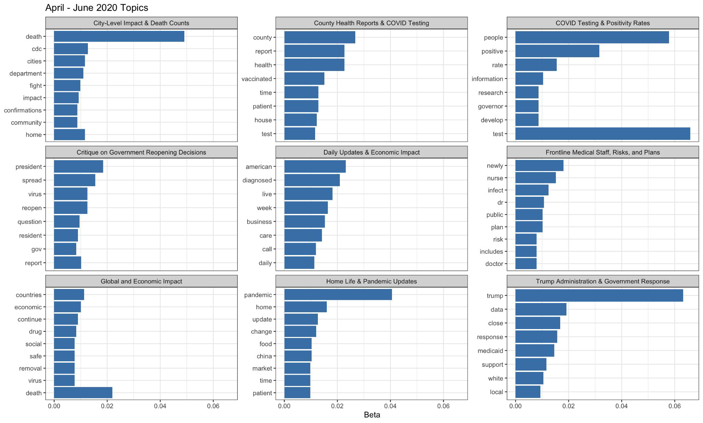
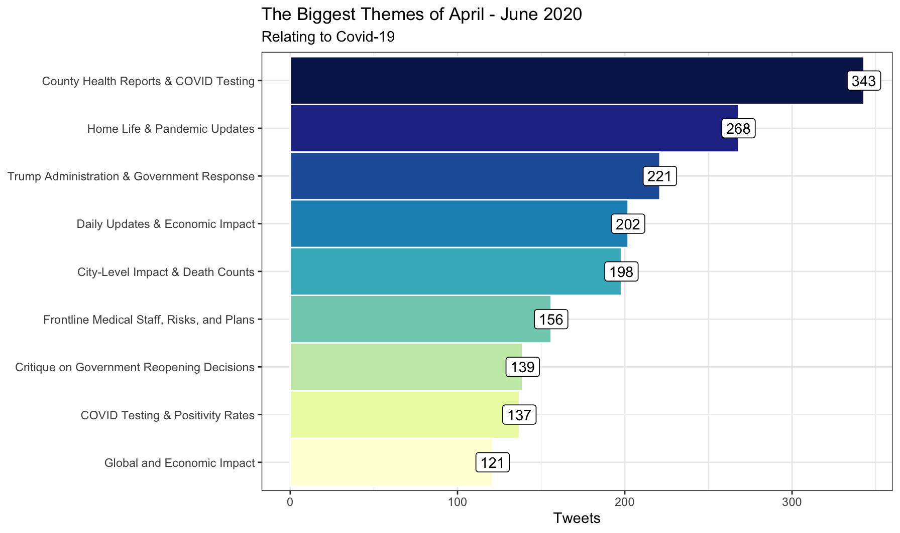
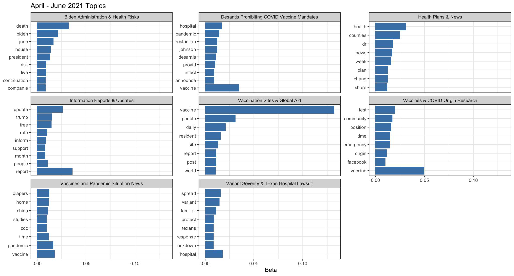
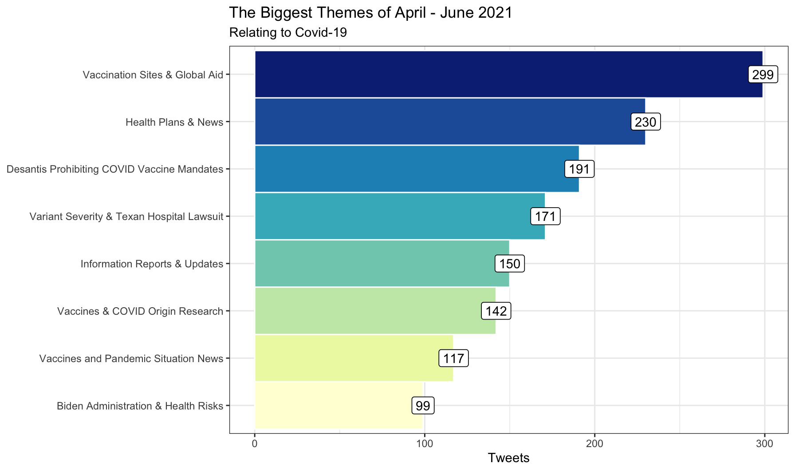

# Mining COVID-19 Conversations in Florida

**LIS4761 – Data & Text Mining · Final Project (Group 3)**

What were Floridians tweeting about during COVID-19, and how did that change in a year? This repo holds our group's analysis of COVID-19 tweets and Florida county-level case data. My part was the **LDA topic model**, comparing the main discussion themes in Florida tweets from **April–June 2020** and **April–June 2021**.

> **Headline finding:** in spring 2020, the conversation was about case counts, testing, and government response. By spring 2021, vaccines dominated almost every topic — where to get them, global aid, and the fight over vaccine mandates.

---

## Project Scope

The project looked at the pandemic from two angles: what the public was saying, and what the county-level data showed.

**Research questions**
1. How did the main COVID-19 discussion topics and sentiment shift across different stages of the pandemic?
2. Which county-level factors best predict the new percent-positive COVID-19 rate in Florida?

**Data**
| Dataset | Source | Description |
|---|---|---|
| COVID-19 tweets | Kaggle | Over 400,000 tweets across three periods (Apr–Jun 2020, Aug–Sep 2020, Apr–Jun 2021), with original text, hashtags, location, and engagement metadata |
| Florida COVID-19 by county | U.S. COVID-19 data library (Oct 30, 2020 snapshot) | County-level testing, positivity, deaths, median age, and monitoring counts |

**Methods across the group**
| Component | Method |
|---|---|
| **Topic modeling (my contribution)** | **LDA on Florida tweets, comparing 2020 with 2021** |
| Exploratory analysis | Interactive R Shiny app over the county data |
| Sentiment analysis | Bing-lexicon positive/negative classification of tweets, plus monthly trend charts |
| Regression | Linear model of `NewPercPos` on `MedianAge`, `EverMon`, and `MonNow` |

**Team:** Jadyn Hollar, Veronica Vaccaro, Kingsley John, Lyndsey Guidash, Kaylen Ton

---

## LDA Topic Modeling

Main file: [`LDA-Topic-Modeling.Rmd`](LDA-Topic-Modeling.Rmd) · rendered report: [`LDA-Topic-Modeling.html`](LDA-Topic-Modeling.html) · slide deck: [`LDA.pdf`](LDA.pdf)

### Goal
Compare the topics and themes in COVID-19 tweets from Florida across two windows exactly one year apart: **April–June 2020** (reopening after lockdown, no vaccine yet) and **April–June 2021** (vaccines widely available).

### Pipeline

```
Raw tweets ─► Filter to Florida ─► Clean text ─► Tokenize + remove stop words
          ─► Stem + stem-complete ─► Word counts per tweet ─► Document-term matrix
          ─► LDA (Gibbs) ─► β: label topics  /  γ: dominant topic per tweet
```

**1. Filtering.** Kept tweets whose `place` matched Florida, and reassigned each a new sequential ID — the original IDs had been stored in scientific notation, which made distinct tweets look like duplicates.

**2. Cleaning, written from scratch** with `qdap`, `tm`, and `stringr`: expanded contractions, wrote numbers out as words, and removed URLs, `RT` markers, @mentions, punctuation, and leftover numbers.

| | Example |
|---|---|
| Original | `@ayemojubar We have lost 3 healthcare workers: Dr Emeka, Dr(PT) Otegbeye and Dr Aminu...yet some still think COVID-… https://t.co/u04st9avXw` |
| Cleaned | `We have lost three healthcare workers Dr Emeka DrPT Otegbeye and Dr Aminuyet some still think COVID…` |

**3. Tokenizing and stop words.** Tokenized with `tidytext::unnest_tokens()` and removed the standard stop words plus a **custom stop-word list** — words that appear in nearly every tweet (`covid19`, `coronavirus`, `florida`), cleaning artifacts (`amp`, `http`, `rt`), and terms that added no value when naming topics.

**4. Stemming and stem completion.** `SnowballC::wordStem()` reduced words to their roots; `tm::stemCompletion()` turned each root back into a readable word using a dictionary built from that period's own tweets. Where stem completion resolved to the wrong word (`viru` → `virus`, `vaccin` → `vaccine`), the fix was applied by hand with `recode()`.

**5. Modeling.** Counted words per tweet, built a document-term matrix with `cast_dtm()`, and fit `topicmodels::LDA()` with Gibbs sampling and a fixed seed for reproducibility.

| Period | k | Seed |
|---|---|---|
| Apr–Jun 2020 | 9 | 67 |
| Apr–Jun 2021 | 8 | 10 |

Several values of **k** were tried; the final value for each period is the one that produced the most clearly interpretable topics.

**6. Interpretation**
- **β (per-topic word probabilities):** plotted the top 8 words in each topic and named each topic by hand.
- **γ (per-document topic probabilities):** assigned each tweet to its highest-γ topic and counted tweets per topic to find the main themes of each period.

### Results

#### April–June 2020: case counts, testing, and government response

<p align="center"></p>
<p align="center"></p>

| # | Topic | Tweets |
|---|---|---|
| 1 | County Health Reports & COVID Testing | 343 |
| 2 | Home Life & Pandemic Updates | 268 |
| 3 | Trump Administration & Government Response | 221 |
| 4 | Daily Updates & Economic Impact | 202 |
| 5 | City-Level Impact & Death Counts | 198 |
| 6 | Frontline Medical Staff, Risks, and Plans | 156 |
| 7 | Critique on Government Reopening Decisions | 139 |
| 8 | COVID Testing & Positivity Rates | 137 |
| 9 | Global and Economic Impact | 121 |

*Context:* Florida ended its stay-at-home order on April 30 and entered Phase 2 of reopening in June. No vaccine existed yet. Tweets were mostly official updates and daily case/death numbers, along with reactions to federal and state decisions.

#### April–June 2021: vaccines everywhere

<p align="center"></p>
<p align="center"></p>

| # | Topic | Tweets |
|---|---|---|
| 1 | Vaccination Sites & Global Aid | 299 |
| 2 | Health Plans & News | 230 |
| 3 | DeSantis Prohibiting COVID Vaccine Mandates | 191 |
| 4 | Variant Severity & Texan Hospital Lawsuit | 171 |
| 5 | Information Reports & Updates | 150 |
| 6 | Vaccines & COVID Origin Research | 142 |
| 7 | Vaccines and Pandemic Situation News | 117 |
| 8 | Biden Administration & Health Risks | 99 |

*Context:* The first vaccines arrived in December 2020. By spring 2021, most age groups were eligible, the U.S. had joined COVAX to send vaccines abroad, and Governor DeSantis had prohibited vaccine and mask mandates as the Delta variant spread.

> The four charts above are exported directly from [`LDA.pdf`](LDA.pdf) into `images/`.

### Takeaways
- **The conversation moved from reporting to debating.** In 2020, tweets tracked numbers: county reports, testing, death counts. In 2021, they argued policy: mandates, variants, lawsuits.
- **Vaccines were the defining change.** Vaccines appear in at least four of the eight 2021 topics; in 2020, "vaccinated" shows up only as a minor word in one topic.
- **The political focus shifted with the administration.** Trump-era briefings and the Medicaid telehealth expansion in 2020 gave way to Biden-era federal policy and state-level mandate fights in 2021.

### Limitations
- **Topic labels are my own judgment.** k was chosen, and topics named, based on what was most interpretable — not an optimized coherence or perplexity score.
- **The location filter is loose.** Matching `"Florida|FL"` in the `place` field can also catch other places whose names contain "FL".
- **Topics share vocabulary.** With a modest number of short documents per period, words like `virus`, `death`, and `test` recur across topics, so the boundaries between them are soft.
- **Hand-fixing stems is manual.** The `recode()` fixes improve readability but would need updating for new data.

---

## Repository Structure

```
├── LDA-Topic-Modeling.Rmd        # ⭐ LDA analysis (final version, mine)
├── LDA-Topic-Modeling.html       # ⭐ Rendered LDA report
├── LDA.pdf                       # ⭐ LDA slide deck
├── CleanerLDA.R                  # Standalone LDA script
├── Covid 19 Group Final.R        # Group EDA / sentiment script
├── Covid Linear Regression       # Regression script
├── ShinyApp                      # Shiny app: tweet sentiment explorer
├── NewCovidShinyApp              # Shiny app: FL county explorer (latest)
├── CovidDataShinyApp             # Shiny app: FL county explorer (earlier iteration)
├── Covid-19 Analytics Project Group 3.pptx   # Final presentation
├── data/
│   ├── COVIDTweetsAprilToJune2020.csv
│   ├── COVIDTweetsAugustToSeptember2020.csv
│   ├── COVIDTweetsAprilToJune2021.csv
│   ├── Florida_COVID19_10302020_ByCounty_CSV_Partial.csv
│   ├── Group 3.Rmd               # Combined group notebook
│   └── Group-3.html
└── images/                       # Chart PNGs exported from LDA.pdf, used in this README
```

## Running the LDA

1. Clone the repo and open `LIS4761 Final Project.Rproj` in RStudio.
2. Install the packages:
   ```r
   install.packages(c("tidyverse", "tidytext", "topicmodels", "qdap",
                      "tm", "SnowballC", "RColorBrewer"))
   ```
   > `qdap` needs Java (`rJava`). If it won't install, see the [qdap install notes](https://github.com/trinker/qdap#installation).
3. Knit `LDA-Topic-Modeling.Rmd`. It reads the tweet CSVs from `data/`. Stem completion is slow, so expect it to take a few minutes.

**Built with:** R · tidyverse · tidytext · topicmodels · tm · qdap · SnowballC · ggplot2
